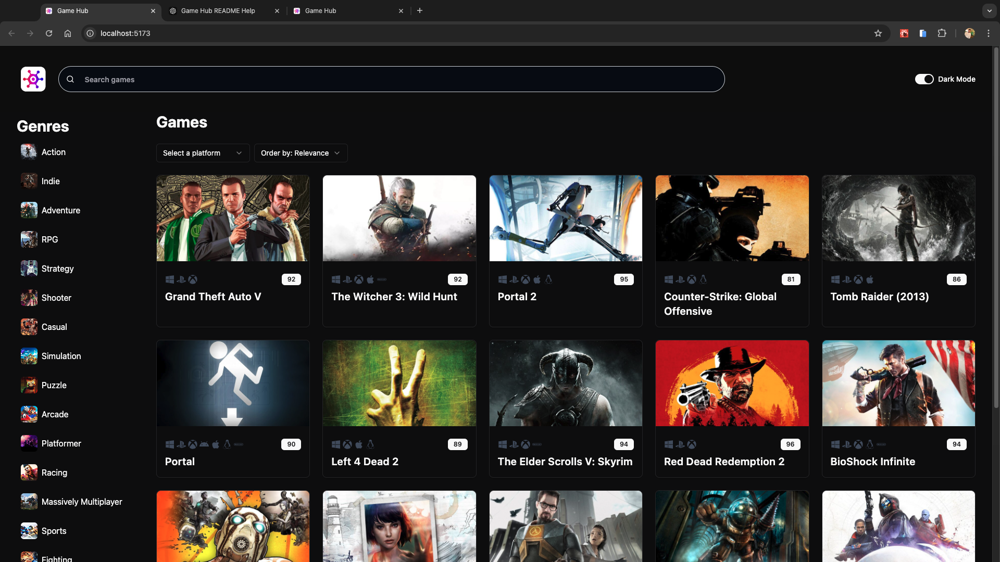

# Game Hub

Game Hub is a video game discovery application built with React and TypeScript. It uses the [RAWG Video Games Database API](https://rawg.io/apidocs) to fetch information about games, allowing users to search, filter, and browse games by genre, platform, and other criteria.

## Features

- **Search**: Quickly find games by name.
- **Filter by genre and platform**: Easily narrow down game results.
- **Sort by popularity, release date, and rating**: Find the most popular or highest-rated games.
- **Responsive design**: Optimized for mobile and desktop devices.

## Screenshots



## Tech Stack

- **React** with **TypeScript**: Frontend framework and type-safe development.
- **RAWG API**: Game data source.
- **Axios**: For making HTTP requests to the RAWG API.
- **Tailwind CSS**: For responsive and custom styling.
- **shadcn/ui**: UI components for rapid and consistent design.

## Installation

To set up the project locally, follow these steps:

1. Clone the repository:
   ```bash
   git clone https://github.com/your-username/game-hub.git
   ```
2. Clone the repository:
   ```bash
   cd game-hub
   ```
3. Install dependencies:
   ```bash
   npm install
   ```
4. Obtain a RAWG API key by signing up at [RAWG.io](RAWG.io) and add it to your environment variables.

5. Create a `.env` file in the root directory and add your API key:
   ```bash
   REACT_APP_RAWG_API_KEY=your_api_key_here
   ```
6. Start the development server:
   ```bash
   npm start
   ```
7. Open http://localhost:5173 in your browser to view the app.

## Usage
- Use the search bar to find specific games.
- Use the genre and platform filters to narrow down results.
- Sort games to view by rating, release date, or popularity.

## Project Structure
The project follows a modular folder structure, with components, pages, and services separated for scalability and easy maintenance:

- components/: Reusable UI components like game cards, filters, and search bar.
- services/: API functions to handle HTTP requests to the RAWG API.
- pages/: Main pages of the application.
  
## Contributing
Contributions are welcome! Feel free to open issues or submit pull requests to improve the app.

## License
This project is licensed under the MIT License. See the LICENSE file for details.

## Acknowledgments
- Thanks to [Mosh Hamedani](codewithmosh.com) for the excellent course on React and TypeScript that inspired this project.
- Game data provided by the [RAWG Video Games Database API](rawg.io).


